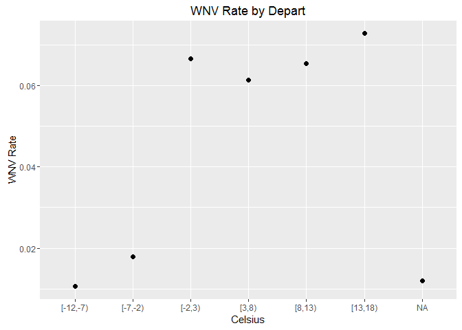

WNV Model EDA Highlights
================
Andrew Bauman, PhD
January 28, 2017

Introduction
============

Selected Density Pots
=====================

Overlaid density plots of Tmin and Tmax by station, where the dashed plot is the mean of the station data. Note that both stations cover the same temperature range, this information is not informative of whether or not to retain data from one station over another or to use the mean. This may be informed by plots temparature vs. WNV rates or through the ML feature selection process.

WNV Rate by Location
====================

The plots below demonstrate a clear relationship between location and the WNV rate.

WNV Rate by Species
===================

WNV Rate by Length of Day
=========================

WNV Rate by Sunrise Time
========================

WNV Rate by Temperature Related Variables
=========================================

WNV Rate by Total Precipitation
===============================

