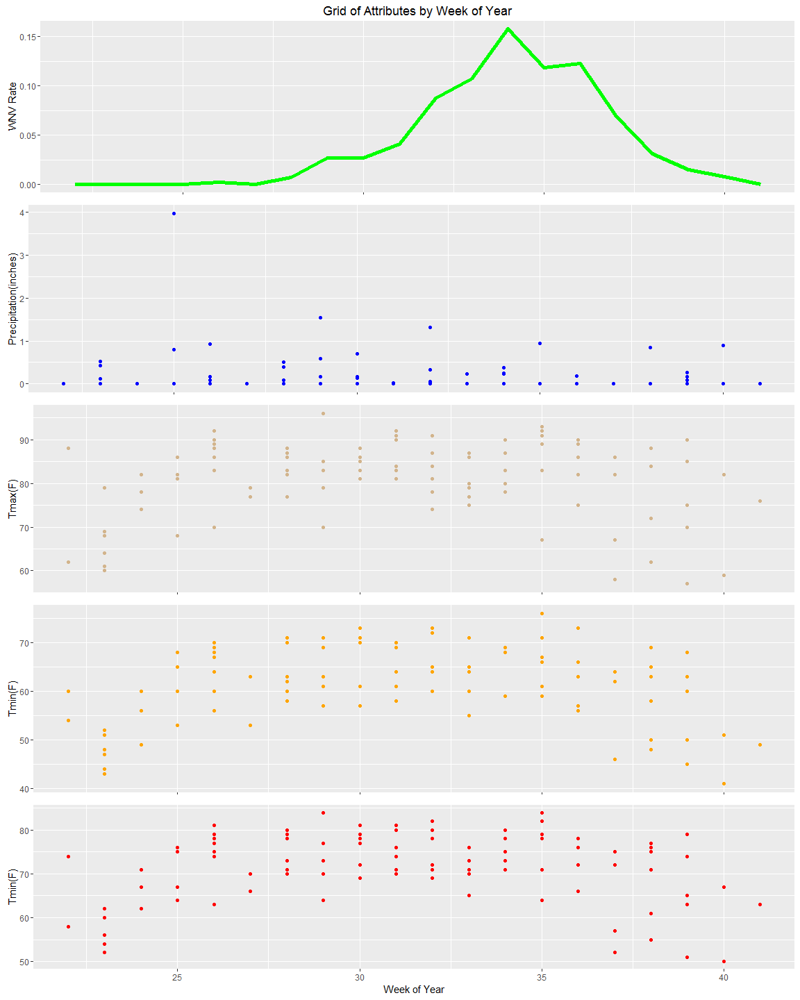

WNV Model EDA Highlights
================
Andrew Bauman, PhD
January 28, 2017

Introduction
============

Exploratory Data Analysis for informing West Nile Virus (WNV) probability models. Selected plots are including, all plots can be found at [WNV\_EDA.R]().

Selected Density Pots
---------------------

Overlaid density plots of Tmin and Tmax by station, where the dashed plot is the mean of the station data. Note that both stations cover the same temperature range, this information is not informative of whether or not to retain data from one station over another or to use the mean. This may be informed by plots temparature vs. WNV rates or through the ML feature selection process.

WNV Rate by Location
--------------------

The plots below demonstrate a clear relationship between location and the WNV rate.

WNV Rate by Species
-------------------

This plot demonstrates a relationship between species and wNV presence.

WNV Rate by Length of Day
-------------------------

Longer days are associated with WNV presence.

WNV Rate by Sunrise Time
------------------------

The number of hours between sunrise and the beginning of the day is predictive of WNV presence.

WNV Rate by Temperature Related Variables
-----------------------------------------

WNV presense appears to follow rising temperatures. The plot for Tmax is particularly interesting as there may be a high and low temperature cluster.

Depart, heat, and cool do not appear to be particularly informative.

WNV Rate by Total Precipitation
-------------------------------

A model where lower precipitaion is predictive of WNv pressence is consitent with the literature for mid-west climate zones.

WNV Rate by Week of Year Compared to Precipitation and and Temperature Attributes
---------------------------------------------------------------------------------

