# Machine Learning Engineer Nanodegree
## Capstone Project (West Nile Virus Prediction in Chicago)
Andrew Bauman, PhD
Q1 2017

## I. Definition

### Project Overview

West Nile virus (WNV), which can result in [West Nile Fever]( https://en.wikipedia.org/wiki/West_Nile_fever) is a bloodborne virus that whose mode of transmission is primarily mosquito to human. According to the World Health Organization [West Nile Virus Fact Sheet]( http://www.who.int/mediacentre/factsheets/fs354/en/)

-	West Nile virus can cause a fatal neurological disease in humans.
-	Approximately 80% of people who are infected will not show symptoms.
-	West Nile virus is mainly transmitted to people through the bites of infected mosquitoes.
-	The virus can cause severe disease and death in horses.
-	Vaccines are available for use in horses but not yet available for people.
-	Birds are the natural hosts of West Nile virus.

#### Transmission and Control Considerations

-	WNV is maintained through a mosquito --> bird --> mosquito cycle where birds are the reservoir hosts
-	The principle vector is considered to be mosquitoes of genus _Culex_ particularly _Cx Pipiens_
-	Birds in North America are particularly susceptible to WNV where infection is highly pathogenic, particularly in crows
-	While birds are a reservoir host, horses are a dead-end host (become infected but don’t spread the infection)
-	WNV outbreaks in animals typically precede human cases so animal health surveillance (bird and horse) are important for early warnings
-	Vector control is achieved through mosquito surveillance and control.  Control  measures consist mainly of source reduction which includes:
    + elimination of mosquito breeding areas through water management (stagnant water is a breeding ground for mosquitoes)
    + administration of chemical and biological agents to destroy mosquito populations


#### West Nile Virus in Chicago

The first cases of West Nile in Chicago were reported in 2002 and by 2004 the City of Chicago and the Chicago Department of Public Health (CDPH) had established a comprehensive surveillance and control system.

- Every week from late spring through the fall, mosquitos in traps across the city are tested for the virus - - Results of these tests influence when and where the city will spray airborne pesticides to control adult mosquito populations.
- The associated [Kaggle competition](https://www.kaggle.com/c/predict-west-nile-virus) asks developers to predict when and where different species of mosquitos will test positive for West Nile virus, in an effort to more effectively allocate surveillance and control resources.

#### Personal Interest

This competition is particularly interesting to the author of this report due to personal contributions to efforts directed at recommending safe and effective control strategies (spray agents as well as timing and manner of spraying) while a graduate student in **Oregon State University's Department of Environmental and Molecular Toxicology Department**.


### Problem Statement

From the [Kaggle competition description](https://www.kaggle.com/c/predict-west-nile-virus):


> Given weather, location, testing, and spraying data, this competition asks you to predict when and where different species of mosquitos will test positive for West Nile virus.

More specifically, from the [Data](https://www.kaggle.com/c/predict-west-nile-virus/data) section:

> In this competition, you will be analyzing weather data and GIS data and predicting whether or not West Nile virus is present, for a given time, location, and species.

The origin of this data is as follows:

- Public health workers set up traps from late May to early October
- From M - W of each week the traps collect mosquitos which are tested for West Nile by the end  of the week
- Test results include [number of mosquitoes, mosquito species, presense or absence of WNV for the cohort]


#### Overview of Data

##### Main Data (Trap Data)

- Each record represents up to 50 tested mosquitos
- Trap locations are described by block number and street name and mapped to Longitude and Latitude
- Satellite traps were used to enhance surveillance.  Each satellite is name by postfixing letters on the parent trap identifier (e.g. T220A is a satellite of T220)
- Not all locations are tested at all times and records only exist when particular species is found at a certain trap at a certain time.  While predictions will be made on all possible combinations, only actual observations will be scored.


##### Spray Data

- GIS data from 2011 - 2013 mosquito spraying
- Spraying reduces mosquito populations and may impact the presence of WNV
- This data will not be incorporated into initial models but may be utilized during
model refinement to see if it leads to improvements


##### Weather Data

- NOAA weather data from 2007 - 2014 during test months
- Hot and dry conditions may favor WNV relative to cold and wet conditions
- Monitoring stations:
    + Station 1: CHICAGO O'HARE INTERNATIONAL AIRPORT Lat: 41.995 Lon: -87.933 Elev: 662 ft. above sea level
    + Station 2: CHICAGO MIDWAY INTL ARPT Lat: 41.786 Lon: -87.752 Elev: 612 ft. above sea level
- Missing date is indicated by "M" (missing) and "T" (trace)

##### Map Data

- Map data is provided from Open Streetmap
- Map data is primarily for visualization purposes but may also be used in model development


#### Evaluation

From the [submission section of the competition](https://www.kaggle.com/c/predict-west-nile-virus/details/evaluation)

> Submissions are evaluated on area under the ROC curve between the predicted probability that West Nile Virus is present and the observed outcomes.

A receiver operating characteristic (ROC) curve is well explained [here](http://www.dataschool.io/roc-curves-and-auc-explained/).  Essentially it is a plot of True positives as a function of false positives where each point on the curve is a (x, y) is the (tru pos, false pos) at any given probability cutoff threshold.  That is the threshold in a binary classification where we label a data instance as one class or another.  By integrating the area under the curve (AUC) we have a single number by which we cna compare models.  The larger the AUC the better or model is at discriminating between classes.

#### Process and Submission

- The model will be developed on public training data and test data both supplied by the host
- The model will be evaluated on private test data supplied by the host, but not revealed to developers

From the submission section of the competition:

> For each record in the test set, you should predict a real-valued probability that WNV is present. The file should contain a header and have the following format:

**Example:**

```
Id,WnvPresent
1,0
2,1
3,0.9
4,0.2
etc.
```

#### Approach to Model Development

This task is well suited to supervised binary classification models, and specifically those models which generate reliable probabilities. Not all supervised models are amenable to this, Naive Bayes models, I'm looking at you.  I will most likely start with an out of the box ensemble model that scales well, such as XGBoost, but may also try a neural net or neural net based deep learning model using Keras.

- Prepare Data (wrangling, pre-processing, etc.)
- Explore data
- Perform additional preparation as revealed by exploration (address outliers and missing data, engineer features, transform data, etc.)
- Determine candidate feature set
- Train and Test models
- Pick model(s) to move into development
- Tune model(s)
- Revisit any previous steps to further inform model
- Create reslts ensembles

Submissions to the privae test set for the competition will be
submitted at major steps to assess performance.


### Metrics

Each model will be evaluated by the AUC of its ROC, as described in the problem statement section. Several other acronyms may be thrown in as part of an psuedo-intellectual shock and awe campaign.


## II. Analysis

### Data Exploration


#### Training Data

The training data consists of 12 columns as described below and is comprised of
the odd data years 2007, 2009, 2011, and 2013.


**Training Data**

Data columns (total 12 columns):
Date                      10506 non-null datetime64[ns]
Address                   10506 non-null object
Species                   10506 non-null object
Block                     10506 non-null int64
Street                    10506 non-null object
Trap                      10506 non-null object
AddressNumberAndStreet    10506 non-null object
Latitude                  10506 non-null float64
Longitude                 10506 non-null float64
AddressAccuracy           10506 non-null int64
NumMosquitos              10506 non-null int64
WnvPresent                10506 non-null int64

The following columns will be excluded from the training data:

```python
['Address', 'AddressNumberAndStreet', 'AddressAccuracy', 'NumMosquitos']
```
Data will be used to merge the  weather and train/test data and will then
be removed.  Note that NumMosquitos was removed because it is not a test data field.

#### Test Data

The test data consists of 11 columns as described below and is comprised of the
even data years 2008, 2010, 2012, 2014.

**Test Data**

Data columns (total 11 columns):
Id                        116293 non-null int64
Date                      116293 non-null datetime64[ns]
Address                   116293 non-null object
Species                   116293 non-null object
Block                     116293 non-null int64
Street                    116293 non-null object
Trap                      116293 non-null object
AddressNumberAndStreet    116293 non-null object
Latitude                  116293 non-null float64
Longitude                 116293 non-null float64
AddressAccuracy           116293 non-null int64

The following columns will be excluded from the test data:

```python
['Address', 'AddressNumberAndStreet', 'AddressAccuracy', 'Id']
```
Data will be used to merge the  weather and train/test data and will then
be removed.

##### Weather Data

The weather data consists of 22 columns as described below. Station 1 has the  full
complement of data whereas Station 1 is  missing [depart, depth, water1, snowfall
sunset, and sunrise]


**Weather**

Data columns (total 22 columns):
Station        2944 non-null object
Date           2944 non-null datetime64[ns]
Tmax           2944 non-null int64
Tmin           2944 non-null int64
Tavg           2944 non-null object
Depart         2944 non-null object
DewPoint       2944 non-null int64
WetBulb        2944 non-null object
Heat           2944 non-null object
Cool           2944 non-null object
Sunrise        2944 non-null object
Sunset         2944 non-null object
CodeSum        2944 non-null object
Depth          2944 non-null object
Water1         2944 non-null object
SnowFall       2944 non-null object
PrecipTotal    2944 non-null object
StnPressure    2944 non-null object
SeaLevel       2944 non-null object
ResultSpeed    2944 non-null float64
ResultDir      2944 non-null int64
AvgSpeed       2944 non-null object


The body of literature regarding WNV mosquito populations and meteorological factors
will be leveraged to select weather features. Only those features which have been
well established in the literature to be predictive of WNV will be retained.  While
other features may be predictive to this local data set a strategy of using literature
validated features may promote a lower variance (more general) model. Literature
information may also inform any features to be engineered.

** Retained Weather Features **

- Station (will be dropped once data sets are complete)
- Date (for use in merging data sets)
- Tmax: Daily maximum temperature in Fahrenheit
- Tmin: Daily minimum temperature in Fahrenheit
- Tavg: Daily average temperature in Fahrenheit
- Depart: Departure from normal temperature in Fahrenheit
- Heat
- Cool
- Sunrise: Calculated time of sunrise CST
- Sunset: Calculated sunset CST
- PrecipTotal


**Weather Stations**

There are two weather stations which contributed to the weather data.  There are
several options for handling this and I have chosen to handle it in the following
manner.

1.  Train models considering each station separately
2.  Train a model with blended (mean) station data

Another option is to calculate which station is nearest each trap and use that data
however geographical proximity to the station does not necessarily mean that stations
reading is more accurate than another, given that neither station is significantly
distant from any trap and that local terrain and geographical features may have such
an impact as to render distance less relevant. Were this strategy to be employed
the Haversine formula would be used since it accounts for the curvature of the earth.


##### Selected Weather Related Literature

There are several key references that help explain the relationship between
weather and WNV. An important take home message is that many of the WNV predictive
models that incorporate climate data are based on temperature and precipitation
departures from long term averages (30 year averages etc.), as well as factors
such as level of precipitation several months prior to the data we are using, for
each year (precipitation during major larvae hatch periods informs the base mosquito
population)  While this information is not part of the data allowed for this
competition many of the spatio-temporal models also use shorter term averages as
well as general concepts that will help inform decisions for the models developed
in this project.

- [Illinois WNV Threat and Climate Division Model](http://mrcc.isws.illinois.edu/research/westnile/IL_CD/index.jsp)
    + climate divisions as the basic spatial unit to aggregate non-homogenous WNV human and mosquito case sampling, and for averaging daily weather data
    + use of precipitation and temperature departures from daily 30-year normals, rather than based on weekly degree days
    + incorporation of 10-day daily temperature and 3-day daily precipitation forecasts to increase the lead time of model usefulness
    + incorporation of the number of mosquito pools testing positive for WNV as reported to the Illinois Department of Public Health

- [Meteorological Conditions Associated with Increased Incidence of West Nile Virus Disease in the United States, 2004–2012](http://m.ajtmh.org/content/92/5/1013.long?view=long&pmid=25802435) A general discussion of weather factors impacting occurence of WNV.
- [The Effects of Weather and Environmental Factors on West Nile Virus Mosquito Abundance in Greater Toronto Area](http://journals.ametsoc.org/doi/pdf/10.1175/EI-D-15-0003.1) Development of a spatiotemporal model variability in Culex pipiens and it's impact on WNV
- [West Nile Virus and Climate](https://www.ncbi.nlm.nih.gov/pmc/articles/PMC3456354/pdf/11524_2006_Article_34.pdf)
- [Local impact of temperature and precipitation on West Nile virus infection in Culex species mosquitoes in northeast Illinois, USA](https://parasitesandvectors.biomedcentral.com/articles/10.1186/1756-3305-3-19) Discusses temporal and spatial patterns of precipitation and air temperature on the timing and location of increased mosquito infection in the northeastern Illinois area.
- [Climate and Weather Impacts on West Nile Virus](http://www.mimosq.org/presentations/2016/4WestcottClimateWNV.pdf) An excellent summary of the impact of climate and weather on WNV prevalence in Illinois and MI (summarizes much of the first few references in a slide show)


##### Geographical Considerations

The following publication highlights increased WNV risk as a function of proximity
to the Des Plaines River (Cook County Illinois). This may bare some relevance to
the current task but also suggests, as common sense would dictate, that proximity
to major water bodies may be a useful feature in predicting WNV mosquito prevalence.

http://online.liebertpub.com/doi/pdfplus/10.1089/vbz.2006.6.91

#### Outliers

No algorithm (Tukey's etc) was run to detect outliers.  Instead data was visually inspected for unusual values during EDA.

#### Examine and Handle Missing Data

The train and test sets do not contain missing data.

The weather data set has a substantial amount of missing data, mostly in Station 2.  Missing data appears as ```-```, 'T', or 'M'.

**What is 'T' and 'M'?**
- From http://www.nws.noaa.gov/om/csd/info/NOWdata/FAQ.php

> "M" stands for "Missing". Data for an element will be missing if the primary sensor for that weather element is inoperable (e.g., has an outage) or malfunctioning (e.g., producing errant data) AND any collocated backup sensor is also inoperable or malfunctioning. "T" stand for "Trace". This is a small amount of precipitation that will wet a rain gauge but is less than the 0.01 inch measuring limit.

All of the missing data is from Station 2.  Station one has 163 instances of 'T',
in the for PrecipTotal.  For Station 2 we have:

- 'M': {'Heat': 11, "Cool": 11, "Depart: 1472", "Tavg": 11, "PrecipTotal": 2}
- '-': {"Sunrise": 1472, "Sunset": 1472}
- 'T': {"PrecipTotal": 155}

1472 records represents all rows for Station 2, meaning that Station 2 does is
missing all Sunrise and Sunset data as well as Depart.  Sunrise and Sunset data
are calculated and should not differ substantially between stations.  So Station 1
Sunrise and Sunset were used to fill for Station 2.  Values of "T" for PrecipTotal
were filled a value of 0.005. It's tempting to make these 0 but actually small
amounts of rain in Midwest climate zones (an amount of rain that tends to form
stagnant water pools such as "puddles")are correlated with West Nile Virus.  Given
this, 0 is unlikely to be the best choice.  All other missing data was filled from
Station 1 as values are unlikely to differ substantially.

Another peculiarity of the data is that 48 Sunset records contained were not validate
military time values.  For example using 1160 hours instead of 1200 hours. This was
addressed by rolling each instant back 1 minute such that 1160 would become 1159.
This was important for downstream feature engineering which required DateTime handling.

All data wrangling, data characterization, feature engineering, and related steps
are detailed in the references [?Put references here?]

#### Feature Engineering

The following features were engineered.  Those features in bold were evaluated during
feature selection. The remaining features were either redundant (night length for
example) or were rejected due to response during EDA.

- **day_of_year**: Integer representing the day of year
- **day**: Integer representing day of the month
- **month**: Integer representing the month
- **week_of_year**: Integer representing the week of the year
- **DayLength_MPrec**: Float of day length with precision in minutes
- **DayLength_NearH**: Length of day rounded to the nearest hour
- NightLength_MPrec: Float of night length with precision in minutes
- NightLength_NearH: Length of night rounded to the nearest hour
- **Sunrise_hours**: Elapsed time, in hours, from midnight to Sunrise
- **Sunset_hours**:  Elapsed time, in hours, from midnight to Sunset
- **blended_Tmax**: Average Tmax of Stations 1 and 2
- **blended_Tmin**: Average Tmin of Stations 1 and 2
- blended_Depart: Average depart of Stations 1 and 2
- blended_Heat: Average heat of Stations 1 and 2
- blended_Cool: Average cool of Stations 1 and 2
- **blended_PrecipTotal**: Average PrecipTotal of Stations 1 and 2


### Exploratory Visualization

EDA is performed and documented in the [?Place reference here?]. Each variable
was with the exception of Lat and Long was visualized (block and street level location
data was visualized instead since they are more general). Plots selected for their
are included below.


#### Density Plots
------------------

Overlaid density plots of Tmin and Tmax by station, where the dashed plot is the mean of the station data. Note that both stations cover the same temperature range, this information is not informative of whether or not to retain data from one station over another or to use the mean. This may be informed by plots temperature vs. WNV rates or through the ML feature selection process.

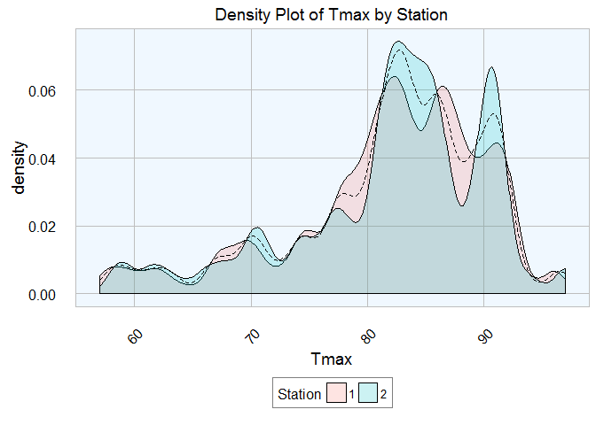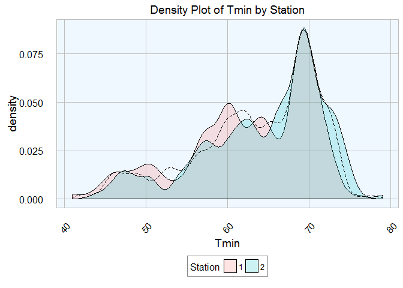

 #### WNV Rate by Location
 ------------------

The plots below demonstrate a clear relationship between location and the WNV rate.

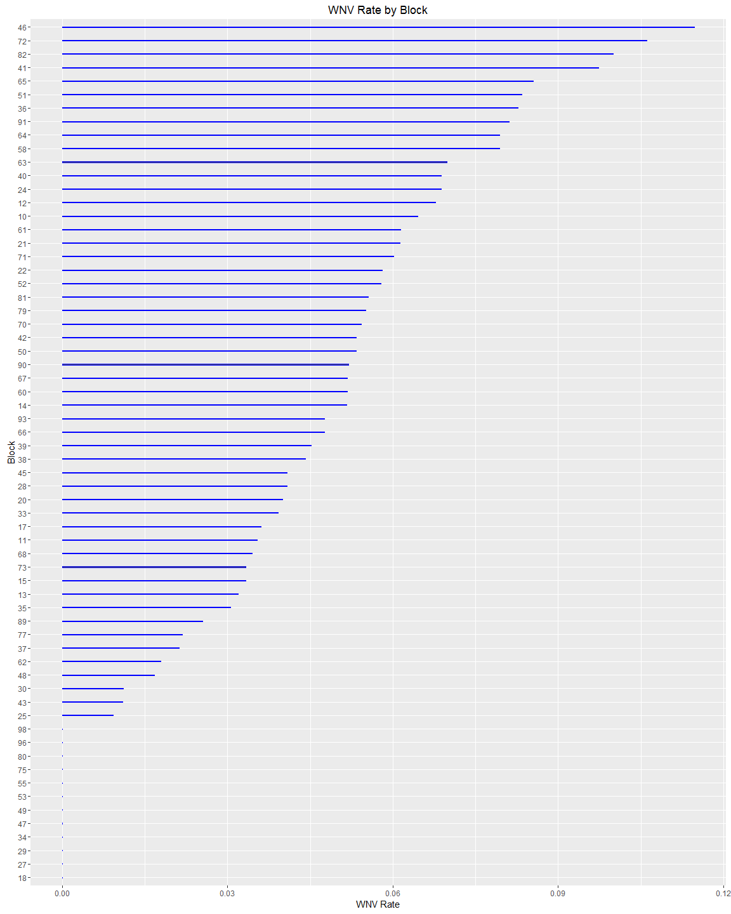

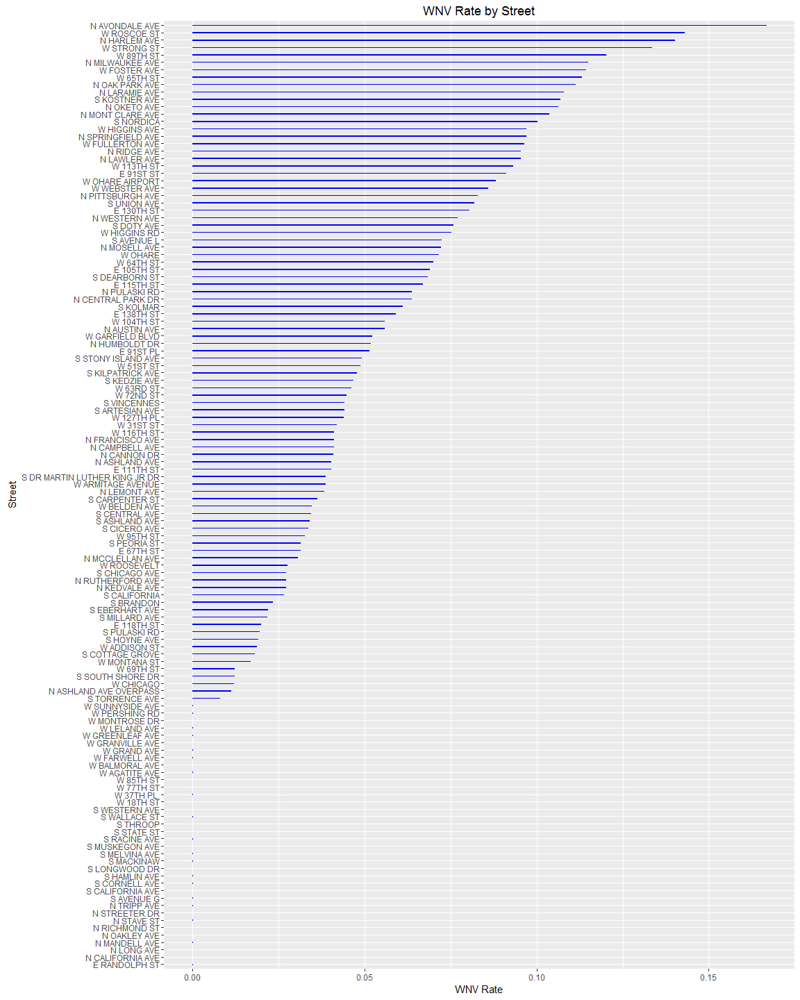

#### WNV Rate by Species
------------------

This plot demonstrates a relationship between species and wNV presence.

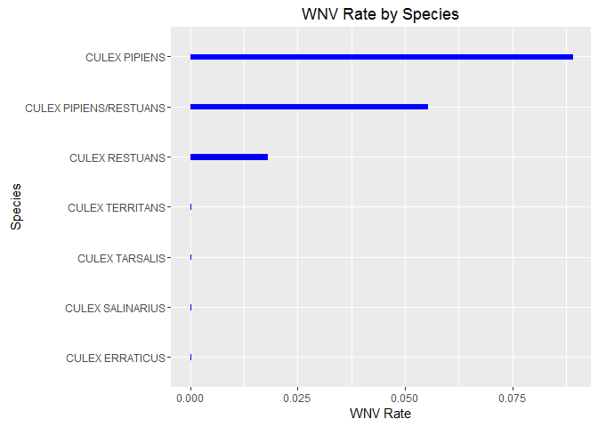

#### WNV Rate by Length of Day
-------------------------

Longer days are associated with WNV presence.

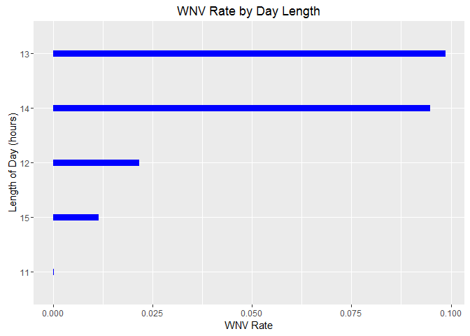

#### WNV Rate by Sunrise Time
------------------------

The number of hours between sunrise and the beginning of the day is predictive of WNV presence.

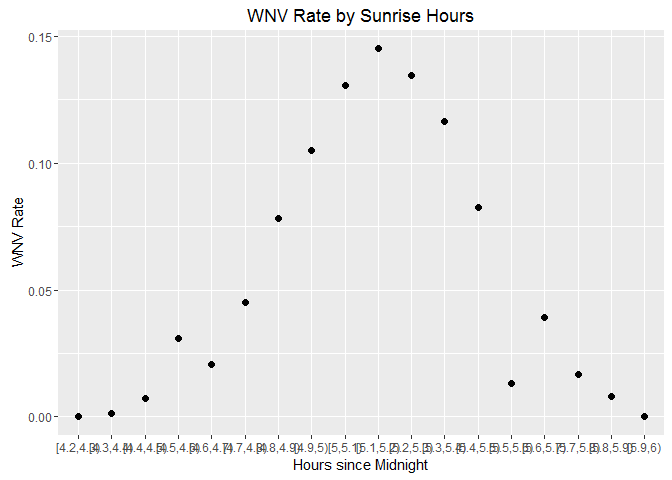

#### WNV Rate by Temperature Related Variables
-----------------------------------------

WNV presence appears to follow rising temperatures. The plot for Tmax is particularly interesting as there may be a high and low temperature cluster.

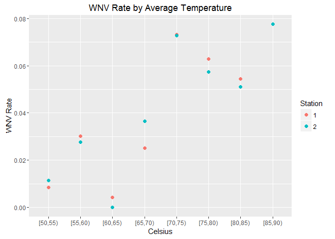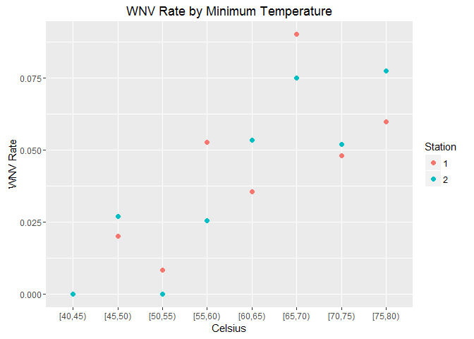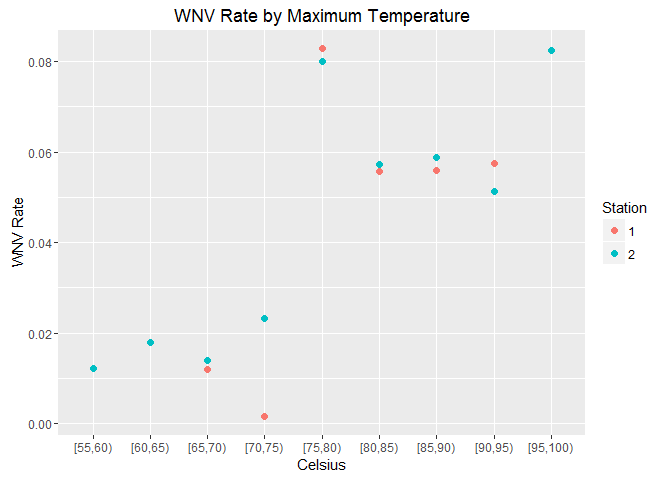

Depart, heat, and cool do not appear to be particularly informative.

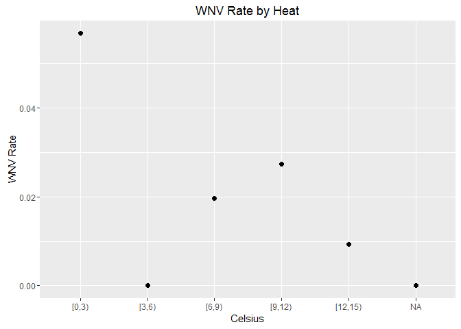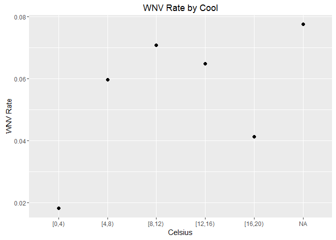

#### WNV Rate by Total Precipitation
-------------------------------

A model where lower precipitation is predictive of WNv presence is consistent with the literature for mid-west climate zones.

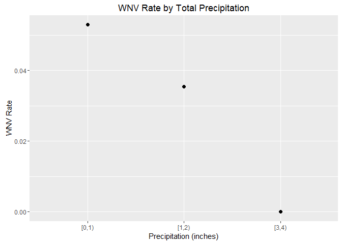

### Algorithms and Techniques

#### Feature Selection

Feature importance from XGBoost (boosted decision trees) will be used to Selection
the final feature set.  An iterable of importance thresholds will be passed to the
classifiers and a final threshold or n features will be selected on the basis of
performance on a hold out of the training set.  All data will be transformed
to extract these features prior to tuning, validation, and submission.


#### Algorithms

Both algorithms were selected for their robust nature (robust to feature scale
and less prone to overfitting).  XGBoost was chosen due to it well earned reputation
as a high performing algorithm, both in terms of metric performance (learns the data
well) and system performance (fast and scalable).

- Random Forest Default Parameters:
```python
RandomForestClassifier(bootstrap=True, class_weight=None, criterion='gini',
            max_depth=None, max_features='auto', max_leaf_nodes=None,
            min_impurity_split=1e-07, min_samples_leaf=1,
            min_samples_split=2, min_weight_fraction_leaf=0.0,
            n_estimators=10, n_jobs=1, oob_score=False, random_state=None,
            verbose=0, warm_start=False)
```

- XGBoost Default Parameters:
```python
XGBClassifier(base_score=0.5, colsample_bylevel=1, colsample_bytree=1,
       gamma=0, learning_rate=0.1, max_delta_step=0, max_depth=3,
       min_child_weight=1, missing=None, n_estimators=100, nthread=-1,
       objective='binary:logistic', reg_alpha=0, reg_lambda=1,
       scale_pos_weight=1, seed=0, silent=True, subsample=1)
```


### Benchmark

My initial benchmark will be that dictated by the competition, which is 50%  In
other words, the initial task will be to produce an algorithm that performs better
than guessing.  Each stage of development will establish a new benchmark.  These
stages are:

- Un-tuned classifiers without rigorous feature selection (run with all features
that pass EDA).

After this stage the training data will be split for use in feature selection, tuning
and validation.
- Un-tuned classifiers with selected features
- Tuned classifier from the previous step.


## III. Methodology

### Data Preprocessing

Data abnormalities and related processing as well as feature engineering have been
described in previous sections. This leaves handling of station data, categorical
variables, latitude and longitude, and feature selection.

#### Categorical variables

The final processing step was to transform categorical
features into dummies.  That is, each categorical value is transformed into its
own field where that feature takes a value of 1 where active (on) and 0 where inactive
(off).  Categorical variables transformed to dummies are Block, Street, Species,
and Trap.

#### Station Specific Data

EDA revealed enough difference between the two stations across variables that it
isn't clear which station should be used or if an average (blended) value should
be used.  Given this station specific data form Tmax, Tmin, PrecipTotal, and Tavg
were created.

#### Latitude and Longitude

An integer version of each of these values was created to see if this impacts performance.


#### Feature Selection

The initial feature set, prior to creation of dummies, consists of:

```python
      ['Species', 'Block', 'Street', 'Trap', 'Latitude',
       'Longitude', 'month', 'day', 'day_of_year', 'week',
       'stat_1_Tmax', 'stat_1_Tmin', 'stat_1_Tavg', 'stat_1_PrecipTotal',
       'DayLength_MPrec', 'DayLength_NearH', 'Sunrise_hours', 'Sunset_hours',
       'blended_Tmax', 'blended_Tmin', 'blended_PrecipTotal', 'stat_2_Date',
       'stat_2_Tmax', 'stat_2_Tmin', 'stat_2_Tavg', 'stat_2_PrecipTotal']
```

Dummies were created from the following features:
- Species
- Street
- Block
- Trap

It's interesting to note that after dummie varible transformation there were some features unique
to both the test and train sets.  This was solved by eliminating unique features
(they aren't relevant if not in test set, and if only in test set we don't have
data on which to train). At this point the feature set expanded to 356.

Feature selection continued with the use of XGBoost's built in feature importance function.  The plot below demonstrates that the vast majority of our 356 features do not impact the target variable.  The top 20 features are.

1. day_of_year
2. Longitude
3. stat_1_Tmin
4. stat_1_Tmax
5. day
6. stat_2_PrecipTotal
7. stat_2_Tmin
8. Species_Culex_RESTUANS
9. Latitude
10. stat_1_Tavg
11. Species_CULEX_TERRITANS
12. blended_Tmin
13. month
14. blended_PrecipTotal
15. Street_S_Kostner_Ave
16. Block_17
17. Street_W_95th_ST
18. stat_2_Tavg
19. Block_25
20. Street_W_Montrose_DR

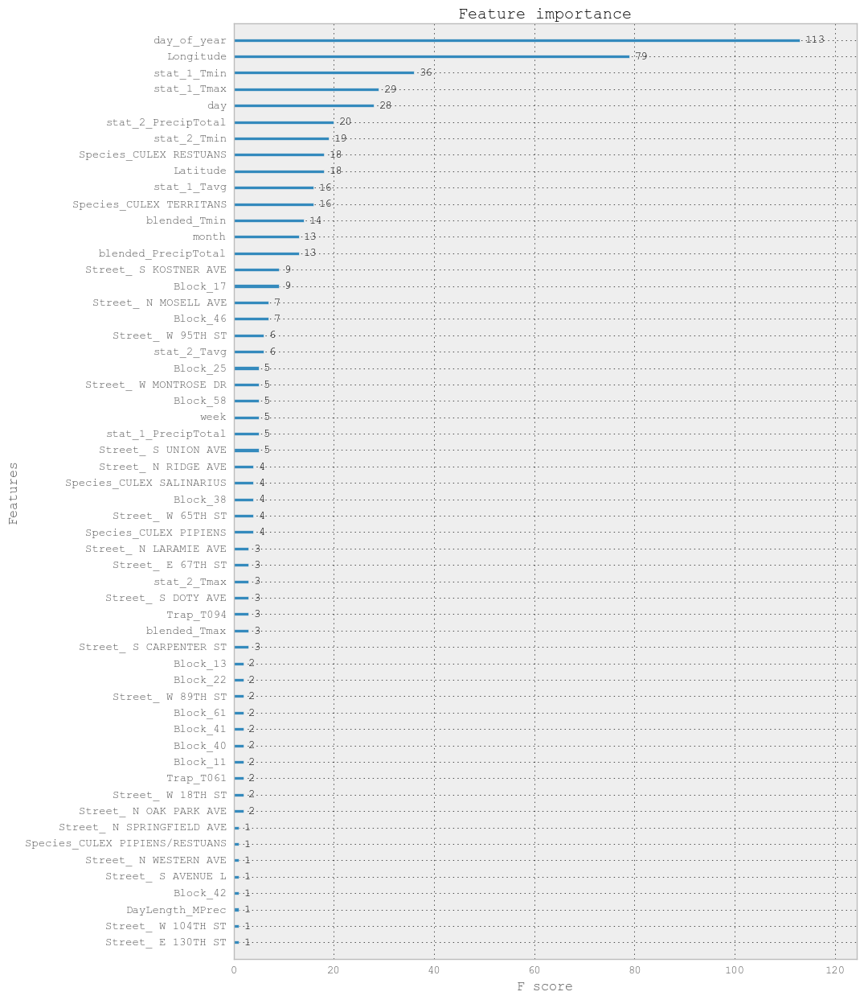

Location data (Street, Block, Latitude, and Longitude) and trap data makes up a large proportion of total features. A course investigation of these features was carried out by submitting the XGboost and Random Forest models to the public and private test set with ALL features and then without location and trap based features. Specific results are tabulated in the results section, but suffice it to say that model performance suffered without these features. This is not suprising since there are several location based features in the top 20 features.

At this point the training data was further broken into a training and test set (referred to as "local validation set"), for purposes of feature selection and tuning. Both the XGBoost and Random Forest model AUC was assessed as a functon of feauture importance.  The code and full results for this can be foud here [?!Notebook Reference!?}].  The results indicated that most of the AUC is recovered by ~ 10 features.

### Implementation and Refinement
Given the information regarding feature importance threshold from the last step, the training set, local validation set, and pubic test set were transformed at a threshold level corresponding to the top 12 features.  The model was trained on the full training set, predictons made on the public test set, and those prediction were submitted to the private test set.  Scores improved for both models and are given in the results section.

A commo cause of overfitting is using too many training rounds.  Afer a certain number of rounds, termed epochs, model bias is reduced at the expense of increased variance.  To account for this early stopping was investigated using the split training and local validation set.  See [!Notebook Here!?] for implementaton details.  The learning curves below capture results for XGBoost.

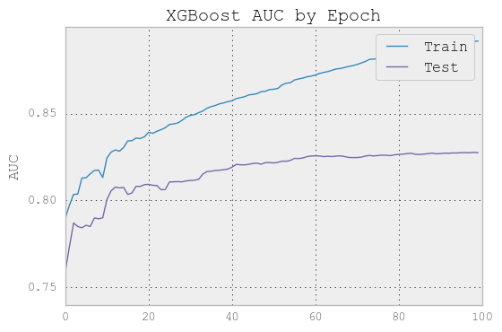

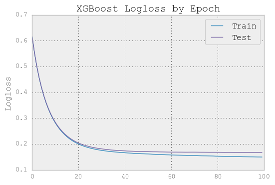

Both curves indicate that variance tends to increase in the neigborhood of 20 epochs.  To mitigate this the XGBoost model passed into tuning will be set with early stopping rounds of 10. That is, if the model does not improve for 10 rounds training will stop. There is no early stopping parameter for Random Forest, so this was not implemented.

#### Tuning
Finally our models are tuned to decrease bias.  Tuning was performed in the following manner:

- Transform all input data from test, local validation using a threshold that captures ~ 16 features (!explain reasoning for this!)
- Tune each model using sklearn randomized search CV where the CV object is StratifiedShuffleSplit.
- XGBoost Parameter Distributions for Sampling and tuning parameters:

```python
n_estimators_dist= sps.randint(1, 300)
learning_rate_dist = [0.01, 0.02, 0.05, 0.1, .15, 0.2, .25, 0.3]
max_depth_dist = sps.randint(2, 12)
colsample_bytree_dist= np.arange(0.2, 0.6, .1)

cv = model_selection.StratifiedShuffleSplit(n_splits = 10, random_state = 42)

n_iter_search = 20
random_search_xgb = model_selection.RandomizedSearchCV(model, param_distributions=param_dist,
                                   n_iter=n_iter_search, scoring= 'roc_auc', cv= cv)
```
- XGBoost Best Estimator:
```python
XGBClassifier(base_score=0.5, colsample_bylevel=1,
       colsample_bytree=0.40000000000000008, gamma=0, learning_rate=0.3,
       max_delta_step=0, max_depth=2, min_child_weight=1, missing=None,
       n_estimators=175, nthread=-1, objective='binary:logistic',
       reg_alpha=0, reg_lambda=1, scale_pos_weight=1, seed=42, silent=True,
       subsample=1)
```
- Random Forest Parameter Distributions For Sampling and tuning parameters:

```python
n_estimators_dist= sps.randint(1, 1000)
cv = model_selection.StratifiedShuffleSplit(n_splits = 10, random_state = 42)

param_dist = {"max_depth": max_depth_dist,
              "max_features": sps.randint(1, n_features),
              "min_samples_split": sps.randint(2, 11),
              "bootstrap": [True, False],
              "criterion": ["gini", "entropy"],
             "n_estimators": n_estimators_dist}

# run randomized search
n_iter_search = 20
random_search_randfor = model_selection.RandomizedSearchCV(clf, param_distributions=param_dist,
                                   n_iter=n_iter_search, scoring= 'roc_auc')
```
- Random Forest Best Estimator
```python
RandomForestClassifier(bootstrap=True, class_weight=None, criterion='entropy',
            max_depth=11, max_features=2, max_leaf_nodes=None,
            min_impurity_split=1e-07, min_samples_leaf=1,
            min_samples_split=9, min_weight_fraction_leaf=0.0,
            n_estimators=891, n_jobs=1, oob_score=False, random_state=42,
            verbose=0, warm_start=False)
```

Both models were then tested on the local validation set (see results section).

XGBoost Training with native xgb class:

Finally the XGBoost Model was trained using the built in CV from the xgb class. The following process was used:

- convert training (all training data with no validation split but same feature selection) data to DMatrix format
- Run cv with the best paramaters above, for 3000 maximum rounds, with early stopping set for no improvement over 10 rounds.
- Determine number of rounds (88)
- Train using the best params and 88 boosting rounds

The test set was then converted to a Dmatrix and the tuned classifier was used to make predictons.  Predictions were submmitted against the public and private board (see results).

#### Ensembling Results

As an experiment I used code at this repo ```https://github.com/MLWave/Kaggle-Ensemble-Guide``` to combine results from both classifiers using voting (several methods) and averaging (several methods). Both methods led to decreased scores (see results) with voting having the worst performance.  This supports a scenario where where both classifiers have strong agreement by which I mean they are both wrong and right in the same way over the same slices of data. This is not suprising since they are both tree/stump based ensembles. To take advantage of voting and averaging of results divergent classifers should be included (orthogonal methods) such as SVM, NN, etc.


## IV. Results
_(approx. 2-3 pages)_

### Model Evaluation and Validation


**State**|**XG Public AUC**|**XG Private AUC**|**RF Public AUC**|**RF Private AUC**
:-----:|:-----:|:-----:|:-----:|:-----:|
All Features Untuned Default Model<sup>1</sup>|0.731|0.712|0.69705|0.65274
No Location/Trap Untuned Default Model<sup>1</sup>|0.684|0.678|0.695|0.682
Feature Transform (Top 12) Default Model<sup>1</sup>|0.736|0.713|0.703|0.657
Feature Transform (Top 16) Best Params Tuned Model<sup>3</sup>|0.725|0.703|0.721|0.686
Feature Transform (Top 16) Best Params CV Tune Early Stop|0.749|0.733|-|-
Best Vote Ensemble<sup>2</sup>|0.741|0.720|-|-
Best Mean Ensemble(Geometric Mean)<sup>2</sup>|0.709|0.699|-|-


<sup>1</sup> RF default with 1000 estimators

<sup>2</sup> Ensemble of both classifier results place under XG for comparison

<sup>3</sup> Validation set (split from test_merge) score ~0.82 for both models

In this section, the final model and any supporting qualities should be evaluated in detail. It should be clear how the final model was derived and why this model was chosen. In addition, some type of analysis should be used to validate the robustness of this model and its solution, such as manipulating the input data or environment to see how the model’s solution is affected (this is called sensitivity analysis). Questions to ask yourself when writing this section:
- _Is the final model reasonable and aligning with solution expectations? Are the final parameters of the model appropriate?_
- _Has the final model been tested with various inputs to evaluate whether the model generalizes well to unseen data?_
- _Is the model robust enough for the problem? Do small perturbations (changes) in training data or the input space greatly affect the results?_
- _Can results found from the model be trusted?_

### Justification
In this section, your model’s final solution and its results should be compared to the benchmark you established earlier in the project using some type of statistical analysis. You should also justify whether these results and the solution are significant enough to have solved the problem posed in the project. Questions to ask yourself when writing this section:
- _Are the final results found stronger than the benchmark result reported earlier?_
- _Have you thoroughly analyzed and discussed the final solution?_
- _Is the final solution significant enough to have solved the problem?_


## V. Conclusion
_(approx. 1-2 pages)_

### Free-Form Visualization
In this section, you will need to provide some form of visualization that emphasizes an important quality about the project. It is much more free-form, but should reasonably support a significant result or characteristic about the problem that you want to discuss. Questions to ask yourself when writing this section:
- _Have you visualized a relevant or important quality about the problem, dataset, input data, or results?_
- _Is the visualization thoroughly analyzed and discussed?_
- _If a plot is provided, are the axes, title, and datum clearly defined?_

### Reflection
In this section, you will summarize the entire end-to-end problem solution and discuss one or two particular aspects of the project you found interesting or difficult. You are expected to reflect on the project as a whole to show that you have a firm understanding of the entire process employed in your work. Questions to ask yourself when writing this section:
- _Have you thoroughly summarized the entire process you used for this project?_
- _Were there any interesting aspects of the project?_
- _Were there any difficult aspects of the project?_
- _Does the final model and solution fit your expectations for the problem, and should it be used in a general setting to solve these types of problems?_

### Improvement
In this section, you will need to provide discussion as to how one aspect of the implementation you designed could be improved. As an example, consider ways your implementation can be made more general, and what would need to be modified. You do not need to make this improvement, but the potential solutions resulting from these changes are considered and compared/contrasted to your current solution. Questions to ask yourself when writing this section:
- _Are there further improvements that could be made on the algorithms or techniques you used in this project?_
- _Were there algorithms or techniques you researched that you did not know how to implement, but would consider using if you knew how?_
- _If you used your final solution as the new benchmark, do you think an even better solution exists?_

-----------

**Before submitting, ask yourself. . .**

- Does the project report you’ve written follow a well-organized structure similar to that of the project template?
- Is each section (particularly **Analysis** and **Methodology**) written in a clear, concise and specific fashion? Are there any ambiguous terms or phrases that need clarification?
- Would the intended audience of your project be able to understand your analysis, methods, and results?
- Have you properly proof-read your project report to assure there are minimal grammatical and spelling mistakes?
- Are all the resources used for this project correctly cited and referenced?
- Is the code that implements your solution easily readable and properly commented?
- Does the code execute without error and produce results similar to those reported?
